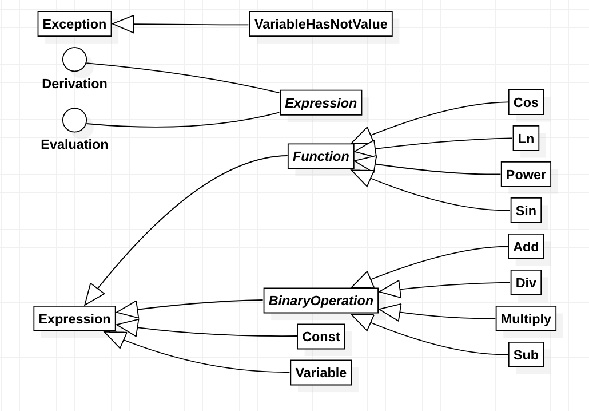

# OO Final Project
In this project I started to design best solution for math expressions with evaluation and derivation functionalities for Object Oriented Systems Design - Spring 99 course.

## How to Use

Define your expression using provided classes and then use `.eval()` or `deriv()` methods on them. 
```java
// (Cos(x) - 1) / y
Expression expr = new Div(new Sub(new Cos(new Variable('x')), new Const(1)), new Variable('y'));
Expression dx = expr.deriv(x);
x.setValue(0);
y.setValue(2);
double value = expr.eval();
```

## Design


## How to Run

To run tests you should have installed `maven` and `java` on your computer. Run below commands to install them:
```bash
sudo apt-get install maven
```

Then you can run tests. Go to project repo and run below command:
```bash
mvn test
```
